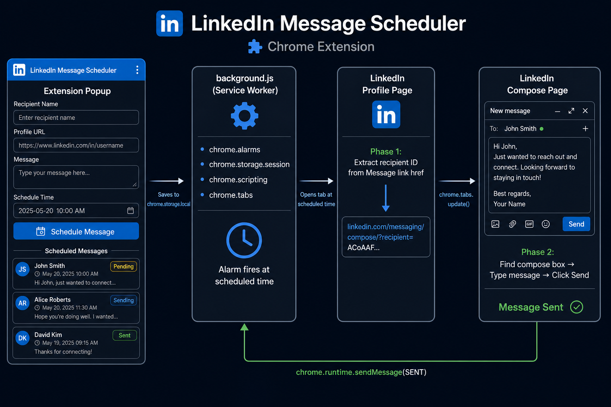

# LinkedIn Message Scheduler

A Chrome Extension that lets you **schedule LinkedIn messages to send automatically** — like Slack's scheduled send, but for LinkedIn.

Write your message now, pick a time, and the extension opens LinkedIn and sends it for you automatically — no manual action needed.

---

## Demo



---

## Features

- **Auto-send** — opens LinkedIn and sends the message automatically at the scheduled time
- **Schedule any future time** — date + time picker with validation
- **Live status tracking** — Pending → Sending → Sent / Failed with real-time popup updates
- **Error details** — if auto-send fails, the popup shows exactly why
- **Copy message** — one-click copy of any drafted message
- **Survives browser restart** — alarms reschedule on Chrome startup; overdue messages send within seconds of Chrome opening
- **No backend, no login, no API** — runs entirely in your browser using your existing LinkedIn session

---

## How It Works

```
1. You save: recipient name + profile URL + message + scheduled time
2. Alarm fires at the scheduled time
3. Extension opens the LinkedIn profile in a new tab
4. Reads the Message button's href → extracts recipient ID
5. Navigates to linkedin.com/messaging/compose/?recipient=<ID>
6. Injects script → finds compose box → types message → clicks Send
7. Status updates to ✅ Sent in the popup
```

The key insight: LinkedIn's Message button contains a `href` with the recipient's unique ID. Instead of clicking it (which opens an iframe overlay), we extract the ID and navigate directly to the full compose page — making the compose box easy to find and interact with.

---

## Tech Stack

| What | Why |
|---|---|
| Chrome Extension Manifest V3 | Latest extension standard |
| `chrome.alarms` | Reliable scheduling, survives service worker sleep |
| `chrome.scripting.executeScript` | Injects automation into LinkedIn tabs |
| `chrome.storage.local` | Persists messages across sessions |
| `chrome.storage.session` | Passes data between service worker wake cycles |
| `chrome.tabs` | Opens and navigates LinkedIn tabs |
| Vanilla JS | No build step, no dependencies |

---

## Project Structure

```
linkedin-message-scheduler/
├── manifest.json      — Chrome MV3 config (permissions, service worker, popup)
├── popup.html         — Extension UI (form + message list)
├── popup.js           — Save, display, delete, copy messages; live storage sync
├── background.js      — Service worker: alarms, tab control, script injection
├── styles.css         — LinkedIn-branded UI styling
└── icons/
    ├── icon16.png
    ├── icon48.png
    └── icon128.png
```

---

## Installation (Load Unpacked)

> No Chrome Web Store needed — load it directly as a developer extension.

1. Clone or download this repository
2. Open Chrome and go to `chrome://extensions/`
3. Enable **Developer Mode** (toggle in the top-right corner)
4. Click **Load unpacked**
5. Select the project folder
6. The extension icon appears in your Chrome toolbar

Every time you edit the code, hit the **refresh icon** on the extension card to reload.

---

## Usage

1. Click the extension icon in your toolbar
2. Fill in:
   - **Recipient Name** — who you're messaging
   - **LinkedIn Profile URL** — their full profile URL (e.g. `https://linkedin.com/in/username`)
   - **Message** — what you want to send (up to 300 characters)
   - **Schedule Date & Time** — must be a future time
3. Click **Schedule Message**
4. At the scheduled time, a new tab opens, the message sends automatically, and the status updates to ✅ Sent

---

## Limitations

- **Chrome must be open** at the scheduled time for the message to send. If Chrome is closed, the message sends the next time you open Chrome (with a short delay).
- **You must be logged into LinkedIn** in Chrome for the automation to work.
- LinkedIn occasionally updates their page structure — if a send fails, the popup shows the exact error so it's easy to diagnose.

---

## What I Learned Building This

- Chrome Extension Manifest V3 architecture (service workers vs persistent background pages)
- Why `chrome.alarms` is more reliable than `setInterval` in MV3 service workers
- DOM automation in a React SPA — `execCommand('insertText')` for contenteditable divs, native value setters for React-controlled inputs
- Debugging cross-frame injection — LinkedIn's Message button opens an `interop=msgOverlay` iframe, which required reading the href and navigating directly instead of clicking
- `chrome.storage.session` for passing state across service worker sleep/wake cycles

---

## License

MIT
